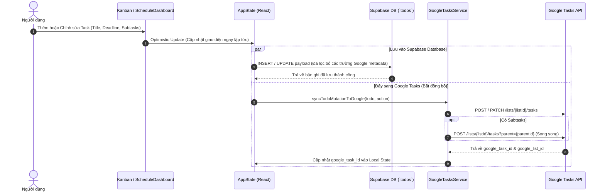
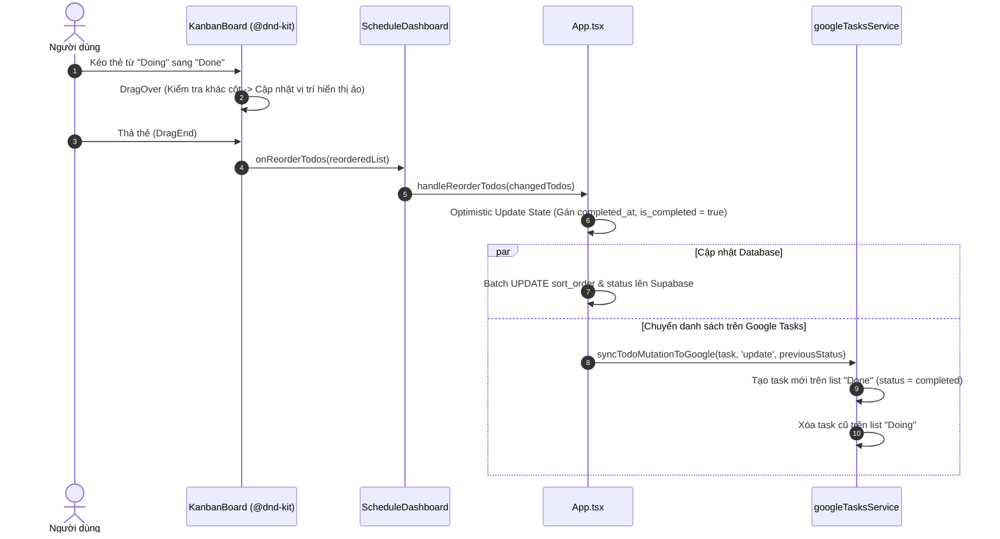
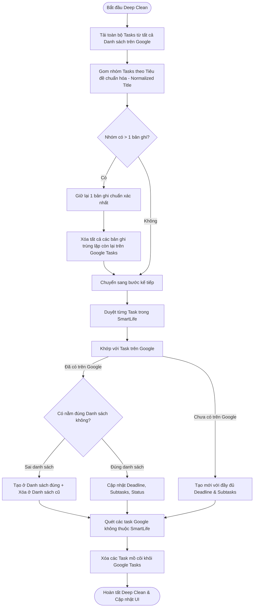

# SmartLife App - Tài Liệu Kiến Trúc & Cập Nhật Hệ Thống (Context_new.md)

> **Cập nhật ngày:** 31/08/2026  
> **Trọng tâm:** Nâng cấp toàn diện Bảng Kanban, Công cụ Đồng bộ 2 Chiều Google Tasks (Two-Way Sync Engine), Quản lý Subtasks cấp tiến, Dọn dẹp trùng lặp toàn cục (Global Deduplication) và Tối ưu hóa hiệu năng render.

---

## 📑 Mục lục
1. [Tổng Quan Các Thay Đổi & Nâng Cấp](#1-tổng-quan-các-thay-đổi--nâng-cấp)
2. [Kiến Trúc Tổng Thể Hệ Thống](#2-kiến-trúc-tổng-thể-hệ-thống)
3. [Mô Hình Dữ Liệu (Data Models & Schema)](#3-mô-hình-dữ-liệu-data-models--schema)
4. [Cơ Chế Đồng Bộ Google Tasks 2 Chiều (Sync Engine)](#4-cơ-chế-đồng-bộ-google-tasks-2-chiều-sync-engine)
   - [4.1. Xác thực & Quản lý Token (Dual Auth Flow)](#41-xác-thực--quản-lý-token-dual-auth-flow)
   - [4.2. Quy tắc Ánh xạ 4 Cột Kanban <-> 4 Task Lists](#42-quy-tắc-ánh-xạ-4-cột-kanban---4-task-lists)
   - [4.3. Đồng bộ Tức thì Độc lập (Instant Mutation Push - SmartLife là Master)](#43-đồng-bộ-tức-thì-độc-lập-instant-mutation-push---smartlife-là-master)
   - [4.4. Cơ chế Xử lý Subtask (Native Child Tasks)](#44-cơ-chế-xử-lý-subtask-native-child-tasks)
   - [4.5. Động cơ Dọn dẹp & Khử trùng lặp Toàn cục (Deep Clean & Rebuild)](#45-động-cơ-dọn-dẹp--khử-trùng-lặp-toàn-cục-deep-clean--rebuild)
   - [4.6. Đồng bộ ngầm, Polling & Focus-Aware Sync](#46-đồng-bộ-ngầm-polling--focus-aware-sync)
5. [Bảng Kanban & Tối Ưu Hóa Trải Nghiệm Kéo Thả](#5-bảng-kanban--tối-ưu-hóa-trải-nghiệm-kéo-thả)
6. [Sơ Đồ Luồng Dữ Liệu Hệ Thống (Sequence & Flowcharts)](#6-sơ-đồ-luồng-dữ-liệu-hệ-thống-sequence--flowcharts)
7. [Bảo Mật, Tương Thích Ngược & Xử Lý Lỗi](#7-bảo-mật-tương-thích-ngược--xử-lý-lỗi)

---

## 1. Tổng Quan Các Thay Đổi & Nâng Cấp

### 🎯 1.1. Google Tasks Two-Way Sync
* **Tự động bắt OAuth Token từ Supabase:** Khi đăng nhập tài khoản Google qua Supabase, hệ thống tự động trích xuất `provider_token` và cấp quyền truy cập Google Tasks API mà không yêu cầu người dùng phải đăng nhập lần 2.
* **Cơ chế Dual Auth:** Hỗ trợ song song đăng nhập trực tiếp qua **Google Identity Services (GIS SDK)** hoặc **Supabase OAuth Provider**.
* **Phân loại 4 Cột Kanban vào 4 Danh sách riêng biệt trên Google Tasks:**
  * **Doing** $\longleftrightarrow$ Danh sách `Doing` / `My Tasks`
  * **Todo** $\longleftrightarrow$ Danh sách `Todo` / `Tasks Week`
  * **Backlog** $\longleftrightarrow$ Danh sách `Backlog` / `Tasks Month`
  * **Done** $\longleftrightarrow$ Danh sách `Done` / `DONE` (đánh dấu `completed`)
* **Tính năng 1-Click Chuẩn hóa tên danh sách Google:** Đổi tên 4 danh sách trên Google Tasks thành `Doing`, `Todo`, `Backlog`, `Done` chỉ bằng 1 nút bấm trong Modal.
* **Đồng bộ Subtask chuyên sâu (Native Child Tasks):** Các việc phụ (subtasks) trong SmartLife được đẩy trực tiếp lên Google Tasks dưới dạng các **Subtask phân cấp thực thụ** (child tasks với tham số `parent`), hỗ trợ phân trang (`pageToken`) và xử lý song song (`Promise.allSettled`).
* **Động cơ Dọn dẹp & Khử trùng lặp Toàn diện (`deepCleanAndRebuildGoogleTasks`):**
  * Tự động quét sạch các task trùng lặp (duplicate tasks) giữa các danh sách.
  * Tự động xóa các task mồ côi (orphan tasks) không tồn tại trong SmartLife.
  * Gom tất cả task đã hoàn thành vào danh sách `Done`.
  * Đẩy toàn bộ dữ liệu sạch từ SmartLife lên Google Tasks (SmartLife là Source of Truth).
* **Lọc bỏ Task Done cũ:** Bỏ qua các task hoàn thành trên 7 ngày để tránh làm chậm ứng dụng và rối bảng Kanban.
* **Auto Sync & Polling:** Tự động đồng bộ ngầm sau mỗi 45 giây, tự động kích hoạt đồng bộ khi chuyển tab / focus lại cửa sổ trình duyệt (`visibilitychange`).

### ⚡ 1.2. Bảng Kanban & Hiệu năng Giao diện
* **Tối ưu hóa 95% Re-render khi kéo thả:** Sử dụng thuật toán so khớp trạng thái (`hasSameBoardState`) và chỉ kích hoạt cập nhật React state khi thẻ di chuyển **xuyên cột** (`activeContainer !== overContainer`).
* **Chiến lược phát hiện va chạm linh hoạt:** Kết hợp `pointerWithin` $\rightarrow$ `rectIntersection` $\rightarrow$ `closestCorners` giúp thao tác kéo thả siêu nhạy, không bị giật lag.
* **Nâng cấp Cột "Done":** Khi kéo thẻ vào Done hoặc bấm hoàn thành, task tự động được chèn lên **đầu danh sách Done** (`sort_order = min - 1`) kèm timestamp `completed_at`.
* **Cải tiến Preview Modal File đính kèm:** Chuyển sang `createPortal(..., document.body)` với z-index `100000`, kích thước rộng rãi chuẩn responsive, xem trực tiếp ảnh, PDF, video, audio, code/text mượt mà.
* **Giao diện Modal Google Tasks:** Thiết kế Glassmorphism hiện đại, hiển thị trực quan trạng thái kết nối, Client ID, chọn danh sách, nút đồng bộ nhanh và nút Deep Clean.
* **Thanh cuộn tự ẩn hiện thông minh (Smart Scrollbars):** CSS `scrollbar-thin` và `custom-scrollbar` tự ẩn khi không dùng và hiển thị nhẹ nhàng khi hover / active, tương thích hoàn hảo Dark Mode.

---

## 2. Kiến Trúc Tổng Thể Hệ Thống

```
+-----------------------------------------------------------------------------------+
|                                 SMARTLIFE CLIENT                                  |
|                                                                                   |
|  +-----------------------------------------------------------------------------+  |
|  |                             App State Context                               |  |
|  |   [ todos | goals | timetable | habits | bookmarks | notes | profile ]      |  |
|  +-----------------------------------------------------------------------------+  |
|         |                                                             |           |
|         v                                                             v           |
|  +---------------------------+                              +-------------------+  |
|  |    ScheduleDashboard      |                              |    AuthContext    |  |
|  |  +---------------------+  |                              |  (Supabase Auth & |  |
|  |  |     KanbanBoard     |  |                              |   Google Token)   |  |
|  |  |  - Backlog | Todo   |  |                              +-------------------+  |
|  |  |  - Doing   | Done   |  |                                        |           |
|  |  +---------------------+  |                                        |           |
|  |  |  GoogleTasksModal   |  |                                        |           |
|  |  +---------------------+  |                                        |           |
|  +---------------------------+                                        |           |
|         |                                                             |           |
|         +------------------------------------+                        |           |
|                                              |                        |           |
|                                              v                        v           |
|                            +-----------------------------------------------+      |
|                            |         Google Tasks Sync Service             |      |
|                            |   - REST Client (v1 API)                      |      |
|                            |   - Two-way Sync Engine                       |      |
|                            |   - Global Deduplication & Clean Engine       |      |
|                            |   - Child Task (Subtask) Synchronizer         |      |
|                            +-----------------------------------------------+      |
+--------------------------------------|--------------------------------|-----------+
                                       |                                |
                                       v                                v
                       +-------------------------------+  +--------------------------+
                       |    Supabase Cloud Database    |  |     Google Tasks API     |
                       |       (PostgreSQL DB)         |  |   (tasks.googleapis.com) |
                       |  - Table: `todos`             |  |   - My Tasks (Doing)     |
                       |  - Realtime Storage           |  |   - Tasks Week (Todo)    |
                       |                               |  |   - Tasks Month (Backlog)|
                       |                               |  |   - Done (Hoàn thành)    |
                       +-------------------------------+  +--------------------------+
```

### Các Tầng Thành Phần Chính:
1. **Presentation Layer (Giao diện):**
   * `ScheduleDashboard.tsx`: Bảng điều khiển trung tâm, quản lý modal tạo/sửa task, điều phối kéo thả Kanban và kích hoạt đồng bộ nền.
   * `KanbanBoard.tsx`: Bảng Kanban 4 cột dựng trên nền `@dnd-kit/core` và `@dnd-kit/sortable`.
   * `GoogleTasksModal.tsx`: Hộp thoại điều khiển tích hợp Google Tasks, cấu hình Client ID, đổi tên danh sách, đồng bộ và dọn dẹp.
   * `QuickNotesWidget.tsx`, `BookmarkWidget.tsx`, `HabitsWidget.tsx`, `PomodoroWidget.tsx`: Các widget tiện ích mở rộng.
2. **Business & Synchronization Layer (Nghiệp vụ & Đồng bộ):**
   * `googleTasksService.ts`: Trung tâm xử lý giao tiếp REST API, quản lý Access Token, ánh xạ trạng thái, đồng bộ subtasks và khử trùng lặp.
   * `taskAttachmentService.ts`: Lưu trữ và trích xuất file đính kèm cục bộ qua IndexedDB.
3. **Data & Auth Layer (Dữ liệu & Xác thực):**
   * `AuthContext.tsx`: Quản lý phiên Supabase, tự động bắt token Google OAuth khi người dùng đăng nhập.
   * `App.tsx`: Quản lý trạng thái toàn cục (`AppState`), optimistic UI updates, đồng bộ tức thì với Supabase và Google Tasks.

---

## 3. Mô Hình Dữ Liệu (Data Models & Schema)

### 3.1. Interface `Todo` (Typescript)
```typescript
export type TodoStatus = 'backlog' | 'todo' | 'doing' | 'done';

export interface SubtaskItem {
  id: string;
  title: string;
  is_completed: boolean;
}

export interface Todo {
  id: string;
  user_id?: string;
  content: string;
  is_completed: boolean;
  priority: 'high' | 'medium' | 'low';
  deadline?: string | null;
  status: TodoStatus;
  sort_order?: number;
  created_at?: string;
  completed_at?: string | null;
  description?: string | null;
  subtasks?: SubtaskItem[];
  email_notify?: boolean;
  email_notify_before_minutes?: number;
  attach_link?: string; // JSON String chứa mảng TaskLink[]
  time_spent?: number;
  
  // Các trường Metadata phục vụ đồng bộ Google Tasks
  google_task_id?: string;
  google_list_id?: string;
  google_synced_at?: string;
}
```

### 3.2. Cấu trúc Đối tượng Google Tasks API
```typescript
export interface GoogleTaskItem {
  id: string;
  title: string;
  updated?: string;
  selfLink?: string;
  parent?: string;           // ID của task cha nếu đây là Subtask
  position?: string;
  notes?: string;            // Chứa Description hoặc Checklist
  status: 'needsAction' | 'completed';
  due?: string;              // RFC 3339 timestamp (ví dụ: 2026-08-31T00:00:00.000Z)
  completed?: string;        // Thời điểm hoàn thành
  deleted?: boolean;
  hidden?: boolean;
  links?: Array<{
    type?: string;
    description?: string;
    link?: string;
  }>;
}
```

---

## 4. Cơ Chế Đồng Bộ Google Tasks 2 Chiều (Sync Engine)

### 4.1. Xác thực & Quản lý Token (Dual Auth Flow)
Hệ thống hỗ trợ 2 hình thức xác thực song song:
1. **Supabase Provider Token (Tự động):** Khi người dùng đăng nhập tài khoản qua Supabase với Scope `https://www.googleapis.com/auth/tasks`, Supabase trả về `provider_token`. `AuthContext` tự động lưu token này vào `localStorage` và phát sự kiện `google_tasks_auth_changed`.
2. **Google Identity Services (GIS Client - Thủ công):** Người dùng có thể tự nhập Google Client ID trong ứng dụng và bấm "Đăng nhập Google". Thư viện GIS SDK sẽ khởi tạo OAuth Popup yêu cầu cấp quyền và trả về `access_token` mới.

### 4.2. Quy tắc Ánh xạ 4 Cột Kanban <-> 4 Task Lists
Để đồng bộ mượt mà giữa mô hình cột của Kanban và mô hình danh sách của Google Tasks, hệ thống thiết lập bảng chuyển đổi hai chiều:

| Cột Kanban (SmartLife) | Danh sách Google Tasks | Trạng thái Google Tasks (`status`) | Mức ưu tiên ngầm định |
| :--- | :--- | :--- | :--- |
| **`doing`** (Đang làm) | **`Doing`** / `My Tasks` | `needsAction` | Focus / High |
| **`todo`** (Cần làm) | **`Todo`** / `Tasks Week` | `needsAction` | Medium |
| **`backlog`** (Tồn đọng/Dự định) | **`Backlog`** / `Tasks Month` | `needsAction` | Low / Chill |
| **`done`** (Hoàn thành) | **`Done`** / `DONE` | `completed` | - |

> **Tính năng tự tạo danh sách (`ensureTimeframeTaskLists`):** Nếu trên tài khoản Google chưa có các danh sách `Todo`, `Backlog`, `Done`, hệ thống sẽ tự động gọi API tạo mới và lưu thông tin vào in-memory cache (thời hạn 60 giây) để giảm tải network.

### 4.3. Đồng bộ Tức thì Độc lập (Instant Mutation Push - SmartLife là Master)
Mỗi khi người dùng thao tác trên SmartLife, hàm `syncTodoMutationToGoogle` được gọi ở chế độ nền (không chặn UI):
* **Tạo mới Task (`action: 'create'`):** Đẩy task lên đúng danh sách Google tương ứng với cột hiện tại + tạo đồng thời các Subtasks con.
* **Cập nhật Task (`action: 'update'`):**
  * Nếu đổi trạng thái cột (ví dụ từ `doing` sang `done` hoặc từ `backlog` sang `todo`): Tự động tạo task mới ở danh sách đích và xóa task ở danh sách cũ để chuyển danh sách sạch sẽ.
  * Nếu giữ nguyên cột: Cập nhật tiêu đề, deadline, notes và đồng bộ các subtasks con.
* **Xóa Task (`action: 'delete'`):** Gọi `deleteGoogleTask` xóa vĩnh viễn task trên Google Tasks.

### 4.4. Cơ chế Xử lý Subtask (Native Child Tasks)
* **SmartLife $\longrightarrow$ Google Tasks (`syncSubtasksToGoogle`):**
  * Đọc danh sách child tasks hiện có của task cha trên Google Tasks.
  * Đối chiếu theo tiêu đề chuẩn hóa (`normalizedTitle`).
  * Những subtask đã có $\rightarrow$ cập nhật trạng thái `completed` / `needsAction`.
  * Những subtask mới $\rightarrow$ tạo mới với query parameter `parent={parentTaskId}`.
  * Những subtask không còn tồn tại trong SmartLife $\rightarrow$ xóa bỏ khỏi Google Tasks.
  * Toàn bộ thao tác diễn ra song song bằng `Promise.allSettled`.
* **Google Tasks $\longrightarrow$ SmartLife (`readGoogleSubtasks`):**
  * Khi kéo dữ liệu về SmartLife, hệ thống đọc các child tasks thực thụ trên Google Tasks và chuyển đổi thành mảng `SubtaskItem[]`.

### 4.5. Động cơ Dọn dẹp & Khử trùng lặp Toàn cục (Deep Clean & Rebuild)
Hàm `deepCleanAndRebuildGoogleTasks` giải quyết triệt để vấn đề rác dữ liệu:
1. **Quét toàn bộ:** Thu thập tất cả các task từ tất cả danh sách trên tài khoản Google (hỗ trợ phân trang nhiều trang `pageToken`).
2. **Gom nhóm theo Tiêu đề (`normalizedTitle`):**
   * Nếu phát hiện 1 task xuất hiện ở nhiều danh sách khác nhau hoặc lặp lại nhiều lần trong cùng 1 danh sách $\rightarrow$ Giữ lại 1 bản ghi chính xác nhất (ưu tiên bản ghi ở đúng danh sách hoặc bản completed gần nhất).
   * **Xóa ngay lập tức tất cả các bản sao thừa còn lại.**
3. **Tái cấu trúc từ SmartLife:**
   * Di chuyển các task đã hoàn thành vào danh sách `Done`.
   * Cập nhật đầy đủ Deadline, Subtasks, Description sang Google Tasks.
4. **Xóa Task mồ côi (Orphan Tasks):**
   * Các task tồn tại trên Google nhưng đã bị xóa khỏi SmartLife sẽ được dọn dẹp sạch sẽ.

### 4.6. Đồng bộ ngầm, Polling & Focus-Aware Sync
* **Background Polling:** Kích hoạt đồng bộ ngầm sau mỗi 45 giây.
* **Focus / Tab Switch:** Lắng nghe sự kiện `visibilitychange` và `window.onfocus`. Ngay khi người dùng quay lại tab SmartLife, ứng dụng kiểm tra và kéo ngay các thay đổi mới nhất từ Google Tasks về.
* **Event-Driven:** Lắng nghe sự kiện `google_tasks_auth_changed` để làm mới trạng thái kết nối ngay lập tức.

---

## 5. Bảng Kanban & Tối Ưu Hóa Trải Nghiệm Kéo Thả

```
+------------------------------------------------------------------------------------------------------+
|                                          KANBAN BOARD                                                |
|                                                                                                      |
|  +--------------------+  +--------------------+  +--------------------+  +--------------------+      |
|  |  BACKLOG (Month)   |  |    TODO (Week)     |  |    DOING (Day)     |  |    DONE (Xong)     |      |
|  +--------------------+  +--------------------+  +--------------------+  +--------------------+      |
|  | [Thẻ Task A]       |  | [Thẻ Task B]       |  | [Thẻ Task C]       |  | [Thẻ Task D]       |      |
|  | - Label / Badge    |  | - Multi Links (2)  |  | - Subtasks (2/3)   |  | - Đã xong          |      |
|  | - Deadline         |  | - File Attachment  |  | - Gmail Reminder   |  | - completed_at     |      |
|  |                    |  |                    |  |                    |  |                    |      |
|  |                    |  |                    |  |                    |  |                    |      |
|  | + Task             |  | + Task             |  | + Task             |  | + Task             |      |
|  +--------------------+  +--------------------+  +--------------------+  +--------------------+      |
+------------------------------------------------------------------------------------------------------+
```

### 5.1. Cơ Chế Tối Ưu Render của `@dnd-kit`
1. **Sensors Calibration:**
   * **Mouse Sensor:** `distance: 4px` (tránh việc click mở thẻ bị hiểu nhầm là kéo thả).
   * **Touch Sensor:** `delay: 150ms`, `tolerance: 6px` (hỗ trợ vuốt cuộn trang tự nhiên trên màn hình cảm ứng).
2. **Loại bỏ Re-render thừa khi di chuyển trong cột:**
   * `handleDragOver` kiểm tra `activeContainer !== overContainer`. Nếu thẻ vẫn đang nằm trong cột hiện tại, hệ thống không gọi `updateLocalTodos`, giúp giữ FPS ở mức 60fps mượt mà.
3. **Xử lý đặc biệt khi kéo vào Done:**
   * Tự động gán `status = 'done'`, `is_completed = true`, thiết lập `completed_at = ISOString`.
   * Đặt task lên vị trí đầu tiên của cột Done để người dùng dễ dàng theo dõi thành quả.

### 5.2. Quản lý Đa Liên Kết & File Đính Kèm
* **Multi-Link Task (`attach_link`):** Cho phép gắn nhiều đường link với tên mô tả tùy chỉnh, tự động đồng bộ sang kho Bookmarks của ứng dụng.
* **File Attachments (IndexedDB Local Preview):**
  * Tải lên các tệp tin đính kèm (hình ảnh, PDF, video, audio, văn bản).
  * Xem trước trực tiếp bằng Modal Portal siêu nét mà không làm chậm cơ sở dữ liệu Supabase.

---

## 6. Sơ Đồ Luồng Dữ Liệu Hệ Thống (Sequence & Flowcharts)

### 6.1. Luồng Tạo Mới / Cập Nhật Task từ SmartLife $\longrightarrow$ Google Tasks & Supabase



### 6.2. Luồng Kéo Thả Chuyển Cột trên Bảng Kanban



### 6.3. Luồng Dọn Dẹp Trùng Lặp & Tái Cấu Trúc Toàn Diện (Deep Clean & Rebuild)



---

## 7. Bảo Mật, Tương Thích Ngược & Xử Lý Lỗi

1. **Tương thích Ngược với Database (DB-Safe Payload):**
   * Các trường metadata phục vụ đồng bộ Google Tasks (`google_task_id`, `google_list_id`, `google_synced_at`) được quản lý linh hoạt trong bộ nhớ và không ép buộc phải có cột trong PostgreSQL.
   * Khi gửi lệnh `UPDATE` hoặc `INSERT` lên Supabase, hàm xử lý tự động tách (`destructure`) và loại trừ các trường này ra khỏi payload để đảm bảo không gặp lỗi `42703 (undefined_column)` hay lỗi Schema Cache.
2. **Chuẩn Hóa Priority Constraint:**
   * Database Supabase có Check Constraint cho cột `priority` (`high`, `medium`, `low`).
   * Hệ thống tự động chuyển đổi các giá trị mở rộng: `urgent` $\rightarrow$ `high`, `focus` $\rightarrow$ `medium`, `chill`/`temp` $\rightarrow$ `low` trước khi ghi xuống cơ sở dữ liệu.
3. **Quản lý Token An Toàn:**
   * Token được lưu trữ cục bộ tại trình duyệt người dùng (`localStorage`), tự động kiểm tra thời gian hết hạn (`expires_at`) với biên an toàn 30 giây.
   * Khi gặp lỗi `401 Unauthorized` từ Google API, hệ thống tự động xóa token và chuyển sang trạng thái ngắt kết nối an toàn.
4. **Cơ Chế Kháng Lỗi Mạng (Fault-Tolerant):**
   * Toàn bộ các cuộc gọi API Google Tasks đều được bọc trong khối `try...catch` và `Promise.allSettled`.
   * Mọi sự cố mạng hoặc gián đoạn dịch vụ Google sẽ không làm ảnh hưởng đến trải nghiệm thao tác của người dùng trên ứng dụng SmartLife.

---
*Tài liệu được biên soạn tự động và đồng bộ với phiên bản mã nguồn mới nhất của dự án SmartLife.*
